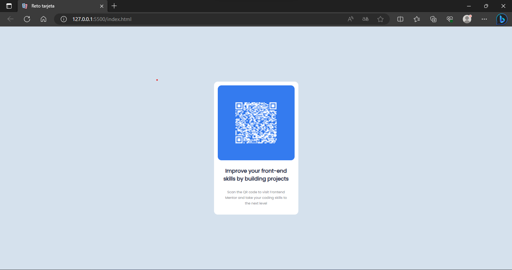

# Práctica utilizando CSS 

*En esta práctica se utilizó la propiedad flexbox para centrar la tarjeta y la imagen del código QR* :shipit:

En el link está el archivo original [Tarjeta_QR](https://res.cloudinary.com/dz209s6jk/image/upload/v1642681473/Challenges/lzfaukzhigbavv5sc26b.jpg).